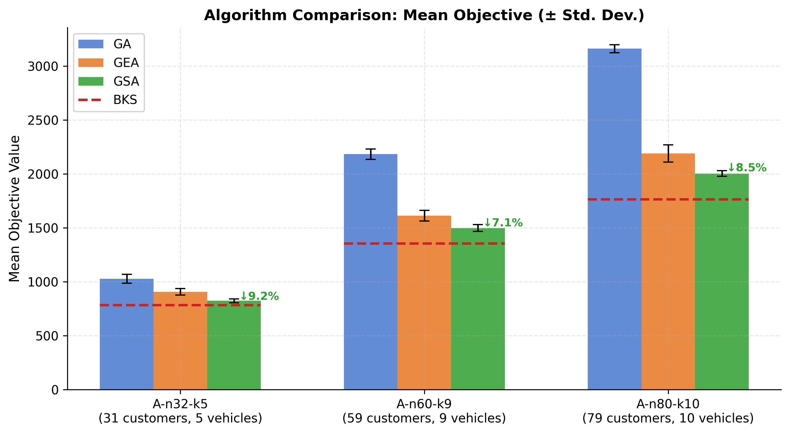
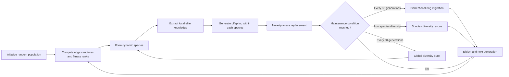
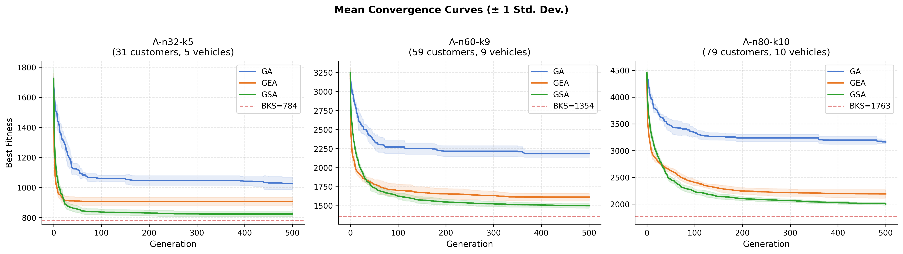
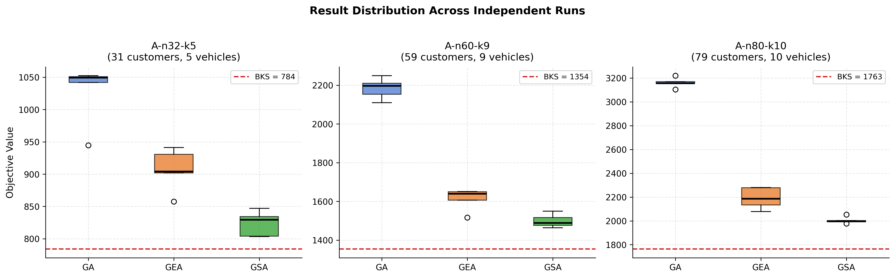
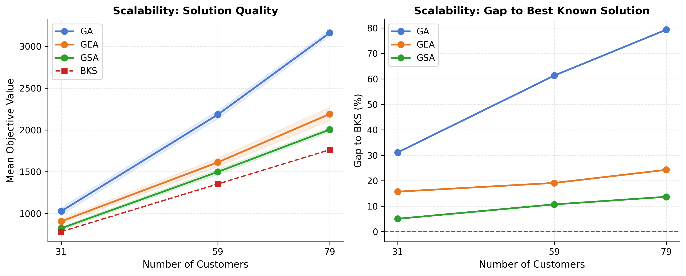
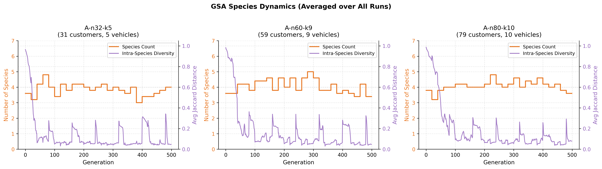
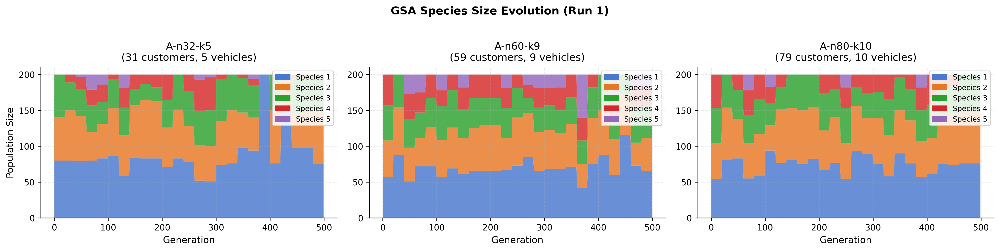

# Genetic Speciation Algorithm

> A speciation-centered evolutionary algorithm for combinatorial optimization, evaluated on the Capacitated Vehicle Routing Problem (CVRP).

[Paper](paper/Genetic%20Speciation%20Algorithm%20for%20Addressing%20Combinatorial%20Optimization%20Problems.pdf) | [Source Code](code/) | [Experimental Results](result/) | [Figures](result/figures_pub/)

## Overview

Genetic algorithms often suffer from **premature convergence** in combinatorial optimization. A few strong individuals may dominate the population too early, causing alternative and potentially useful search directions to disappear.

The **Genetic Speciation Algorithm (GSA)** addresses this problem by dynamically dividing the population into several species according to solution-structure similarity and fitness information. Instead of evolving one fully mixed population, each species searches within its own niche, while limited migration allows useful information to spread between species.

This repository contains the implementation and experimental results accompanying the paper *Genetic Speciation Algorithm for Addressing Combinatorial Optimization Problems*. The method is evaluated on the CVRP, where candidate solutions are customer permutations and species are formed primarily from route-edge similarity.

The experiments show that GSA achieves better mean solution quality and lower run-to-run variation than both a standard Genetic Algorithm (GA) and a non-speciated Genetic Engineering Algorithm (GEA) on all three tested Augerat A-set instances.



## Key Ideas

### Solution representation and evaluation

A candidate solution is encoded as a permutation of all customers:

```text
pi = [c1, c2, ..., cn]
```

The depot is not explicitly included in the chromosome. During evaluation, customers are scanned from left to right. If adding the next customer would exceed vehicle capacity, the current vehicle returns to the depot and a new route starts with that customer. The objective is the total Euclidean distance of all decoded routes, so lower fitness values are better.

### Dynamic species formation

For a chromosome `pi`, the algorithm extracts an undirected edge set from the sequence `[0, c1, c2, ..., cn, 0]`, where `0` denotes the depot. Structural difference is measured using Jaccard distance:

```text
D_edge(A, B) = 1 - |E(A) intersection E(B)| / |E(A) union E(B)|
```

The final clustering distance combines structural difference and normalized fitness-rank distance:

```text
D(A, B) = 0.80 * D_edge(A, B) + 0.20 * D_rank(A, B)
```

Species are formed using a Wishart-style density clustering procedure. Large provisional species are recursively split with two-medoids, very small species are absorbed into their nearest larger species, and the total number of species is limited to five. Reclustering occurs every 20 generations, allowing species membership to change as the population evolves.

### Evolution within species

Each species extracts its own local elite information and evolves independently using:

- **Order crossover**, which preserves a segment from one parent and completes the chromosome using the order of another parent;
- **Swap mutation**, which exchanges two randomly selected customer positions;
- **Dominant-chromosome crossover (S1)**, which crosses a representative local elite with another member of the same species;
- **Directed mutation (S2)**, which protects informative structures and applies improving 2-opt and Or-opt moves to non-informative positions;
- **Edge injection (S3)**, which transfers high-frequency elite edges into weaker individuals.

Every offspring passes through novelty-aware replacement. A child is considered only when its average edge similarity to the current species is below `0.92`. It can then replace the most structurally similar species member with worse fitness. This prevents excessive duplication while allowing improved new structures to enter the species.

### Inter-species interaction and diversity maintenance



- Bidirectional ring migration is performed every 30 generations.
- If average intra-species Jaccard distance falls below `0.04`, the worst 30% of that species is replaced with random permutations.
- At every generation, random candidates are tested against the worst 3% of the global population.
- Every 80 generations, the worst 25% of the population is replaced with random individuals and reclustering is forced.
- Global elitism preserves the best solution found so far.

## Experimental Results

The experiments use three instances from the Augerat A-set CVRP benchmark. GA, GEA, and GSA use the same population size of `200`, a maximum of `500` generations, and `5` independent runs per instance. BKS denotes the best known solution.

| Instance | Algorithm | Best | Mean | Std. Dev. | Gap to BKS | Avg. Time |
|---|---:|---:|---:|---:|---:|---:|
| A-n32-k5 | GA | 944.6 | 1027.9 | 41.79 | 31.1% | 4.5 s |
|  | GEA | 857.6 | 907.1 | 28.99 | 15.7% | 12.1 s |
|  | **GSA** | **803.3** | **823.6** | **17.27** | **5.1%** | 55.5 s |
| A-n60-k9 | GA | 2110.1 | 2184.1 | 48.12 | 61.3% | 6.8 s |
|  | GEA | 1517.2 | 1613.0 | 50.63 | 19.1% | 17.5 s |
|  | **GSA** | **1463.7** | **1499.0** | **30.72** | **10.7%** | 90.9 s |
| A-n80-k10 | GA | 3104.7 | 3161.3 | 36.98 | 79.3% | 8.0 s |
|  | GEA | 2078.1 | 2190.9 | 79.58 | 24.3% | 20.7 s |
|  | **GSA** | **1978.1** | **2004.2** | **25.30** | **13.7%** | 132.4 s |

Compared with GEA, GSA reduces the mean gaps to the best known solutions from `15.7%`, `19.1%`, and `24.3%` to `5.1%`, `10.7%`, and `13.7%`, respectively. GSA also produces the lowest standard deviation on all three instances. The main trade-off is runtime: clustering, diversity monitoring, and inter-species interaction add computational cost.

### Convergence behavior

GSA continues improving after GA and GEA have begun to stagnate. Maintaining several structural niches allows alternative route patterns to survive long enough to be refined.



### Robustness across independent runs

The tighter GSA distributions show that speciation improves not only the best observed result but also the reliability of the search, particularly on the larger instances.



### Scalability

As the number of customers increases, the gap to the best known solution grows rapidly for GA. GEA and GSA remain more competitive, with GSA achieving the smallest gap at every tested scale.



### Species dynamics

Species are not static labels. Their number, diversity, and relative sizes change during evolution as the population is reclustered and different search niches grow or shrink.





## Quick Start

### Requirements

- Python 3.9 or newer
- NumPy
- Matplotlib and SciPy for regenerating the figures

```bash
git clone https://github.com/Uuu-7/Genetic-Speciation-Algorithm.git
cd Genetic-Speciation-Algorithm
python -m pip install numpy matplotlib scipy
```

### Run GSA from Python

Save the following example in the repository root and run it with Python:

```python
import sys
from pathlib import Path

import numpy as np

ROOT = Path(__file__).resolve().parent
sys.path.insert(0, str(ROOT / "code"))

from run import load_vrp_from_file
from gsa.gsa import run_gsa
from gsa.population import random_population

problem = load_vrp_from_file(ROOT / "data" / "A-n32-k5.vrp")
rng = np.random.default_rng(42)
population = random_population(problem, size=200, rng=rng)

best, history, species_stats = run_gsa(
    problem,
    population,
    generations=500,
    rng=rng,
    record_stats=True,
)

print(f"Best objective: {best.fitness:.2f}")
print("Routes:", problem.decode_routes(best.perm))
print("Valid:", problem.validate_solution(best.perm))
```

The complete comparison configuration is available in [`code/run.py`](code/run.py), including GA, GEA, GSA, five independent runs, and GSA species-statistics collection. The raw experimental output is provided in [`result/experiment_results.json`](result/experiment_results.json). Figure generation is implemented in [`code/visualization.py`](code/visualization.py), and all generated figures are stored in [`result/figures_pub/`](result/figures_pub/).

> **Path note:** the current scripts refer to `data/vrp/` and `results/`, while this repository stores the corresponding files in `data/` and `result/`. Update these paths in `code/run.py` and `code/visualization.py` before running the complete experiment or regenerating all figures.

## Main Experimental Parameters

| Parameter | Value |
|---|---:|
| Population size | 200 |
| Maximum generations | 500 |
| Hybrid-distance weight `alpha` | 0.20 |
| Maximum number of species | 5 |
| Minimum species size | 3 |
| Reclustering interval | 20 generations |
| Migration interval | 30 generations |
| Diversity-burst interval | 80 generations |
| Local elite ratio | 0.40 |
| Informative-edge threshold | 0.55 |
| Novelty-similarity threshold | 0.92 |
| Species-diversity collapse threshold | 0.04 |

Additional parameters are documented in [`run_gsa`](code/gsa/gsa.py), while species formation is implemented by [`wishart_cluster`](code/gsa/speciator.py).

## Repository Structure

```text
.
|-- code/
|   |-- run.py                 # GA, GEA, and GSA experiment entry point
|   |-- visualization.py       # Publication figure generation
|   `-- gsa/
|       |-- gsa.py             # Main GSA evolutionary loop
|       |-- gea.py             # GA and GEA baselines
|       |-- speciator.py       # Wishart-style dynamic clustering
|       |-- operators.py       # Crossover, mutation, and edge injection
|       |-- mask.py            # Edge frequency and informative masks
|       |-- problem.py         # CVRP evaluation, decoding, and validation
|       `-- ...
|-- data/                      # Augerat A-set instances
|-- paper/                     # Project paper in PDF format
|-- result/
|   |-- experiment_results.json
|   `-- figures_pub/           # Experimental figures embedded above
`-- README.md
```

## Implementation Notes

- The current implementation targets permutation-encoded CVRP instances.
- Edge sets are constructed from chromosome order, while objective values are calculated from capacity-based greedy route decoding.
- Pairwise Jaccard distances are computed using a binary edge matrix and NumPy matrix multiplication to reduce clustering overhead.
- `fast_evaluate` is used inside the evolutionary loop; complete permutation and capacity validation is performed only when reporting a final solution.
- For stricter reproducibility, fix both the NumPy seed and the `PYTHONHASHSEED` environment variable.
- GSA trades additional runtime for improved solution quality and robustness. Parallel evolution of individual species is a promising direction for future work.

## Citation

If this repository is useful in your research, please cite the accompanying paper:

```bibtex
@unpublished{xia2026gsa,
  author = {Xia, Yuqi},
  title  = {Genetic Speciation Algorithm for Addressing Combinatorial Optimization Problems},
  note   = {Term paper, Faculty of Computer Science, National Research University Higher School of Economics},
  year   = {2026}
}
```

## References

1. Holland, J. H. *Adaptation in Natural and Artificial Systems*. University of Michigan Press, 1975.
2. Sohrabi, M., Fathollahi-Fard, A. M., and Gromov, V. A. "Genetic Engineering Algorithm (GEA): An Efficient Metaheuristic Algorithm for Solving Combinatorial Optimization Problems." *Automation and Remote Control*, 85(3), 252-262, 2024.
3. Wishart, D. "Mode Analysis: A Generalization of Nearest Neighbor Methods for Use in Clustering and Pattern Recognition." In *Numerical Taxonomy*, Academic Press, 1969.
4. Augerat, P. et al. *Computational Results with a Branch-and-Cut Code for the Capacitated Vehicle Routing Problem*. Research Report 949-M, 1995.
